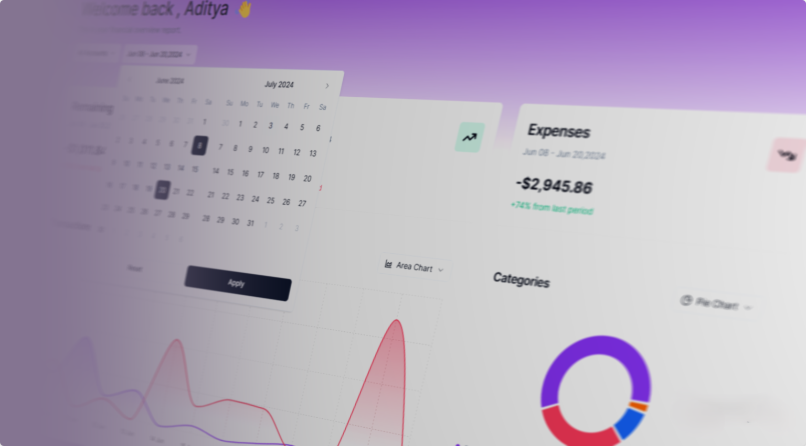

# Track. Manage. Visualize Your Finances.



# Key Features:
- 📊 Interactive financial dashboard
- 🔁 Changeable chart types
- 🗓 Account and date filters
- 💹 Detailed transactions table
- 🔄 CSV transaction imports
- ➕ Form to add transactions
- 🧩 Customizable select components
- 💵 Income and expense toggle
- 🔥 API via Hono.js
- 🪝 State management via Tanstack React Query
- 🔐 Authentication via Clerk (Core 2)
- 🗑  Bulk delete and search in transactions
- 🌐 Built with Next.js 14
- 🎨 Styled with TailwindCSS and Shadcn UI
- 💾 PostgreSQL & Drizzle ORM


##  Setting up the project locally

1. Make sure **Git** and **NodeJS** is installed.
2. Clone this repository to your local computer.
3. Create `.env.local` file in **root** directory.

Sample `.env.local` file:

```env
# .env.local

# clerk auth keys
NEXT_PUBLIC_CLERK_PUBLISHABLE_KEY=
CLERK_PUBLISHABLE_KEY=
CLERK_SECRET_KEY=

# clerk redirect url
NEXT_PUBLIC_CLERK_SIGN_IN_URL=/sign-in
NEXT_PUBLIC_CLERK_SIGN_UP_URL=/sign-up

# db url
DATABASE_URL=

NEXT_PUBLIC_APP_URL=http://localhost:3000

```

4. Obtain Clerk Authentication Keys

   1. **Source**: Clerk Dashboard or Settings Page
   2. **Procedure**:

      - Log in to your Clerk account.
      - Navigate to the dashboard or settings page.
      - Look for the section related to authentication keys.
      - Copy the `NEXT_PUBLIC_CLERK_PUBLISHABLE_KEY` and `CLERK_SECRET_KEY` provided in that section.

5. Retrieve Supabase Database URI

   1. **Source**: Database Provider (e.g. Supabase)
   2. **Procedure**:
      - Access your database provider's platform or configuration.
      - Locate the database connection details.
      - Copy the Database connection string and replace **[YOUR-PASSWORD]** with your database password

6. Install Project Dependencies using `npm install --legacy-peer-deps` or `yarn install --legacy-peer-deps`.

7. Migrate database:

In terminal, run `npm run db:generate` to generate database client and `npm run db:migrate` to make sure that your database is up-to-date along with schema.

8. Run the Seed Script:

In the same terminal, run the following command to execute the seed script:

`npm run db:seed`

This command uses `npm` to execute the Typescript file (`scripts/seed.ts`) and writes transaction data in database.

9. Verify Data in Database:

Once the script completes, check your database to ensure that the transaction data has been successfully seeded.

10. Now app is fully configured 👍 and you can start using this app using either one of `npm run dev` or `yarn dev`.
